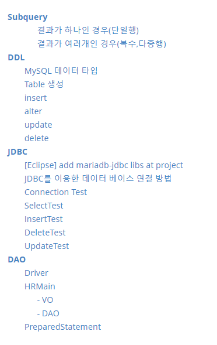
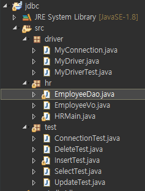

[TOC]



# Subquery

> - 서브쿼리는 괄호로 묶여야함
> - 서브쿼리 내에 `order by` 금지
> - `group by`절 외에 거의 모든 구문에서 사용가능
> - 형식 연산자
>   - **단일행** 연산자 ( =, >,  >=,  <, <=, <> )
>   - **복수행** 연산자 ( IN, ANY, ALL, NOT IN )  


### 결과가 하나인 경우(단일행)

> **단일행 연산자 ( =, >,  >=,  <, <=, <> )**

```mysql
-- 현재 Fai Bale이 근무하는 부서에서 근무하는 직원의 사번, 전체 이름을 출력
-- 부서찾기
select b.dept_no
from employees a, dept_emp b
where a.emp_no = b.emp_no
and b.to_date='9999-01-01'
and concat(a.first_name,' ',a.last_name) = 'Fai Bale';

-- 그 부서 직원들 찾기
select a.emp_no, concat(a.first_name,' ',a.last_name)
from employees a, dept_emp b
where a.emp_no = b.emp_no
and b.to_date = '9999-01-01'
and b.dept_no = 'd004';

-- subquery로 한번에
select a.emp_no, concat(a.first_name,' ',a.last_name)
from employees a, dept_emp b
where a.emp_no = b.emp_no
and b.to_date = '9999-01-01'
and b.dept_no = (select b.dept_no
				from employees a, dept_emp b
				where a.emp_no = b.emp_no
				and b.to_date='9999-01-01'
				and concat(a.first_name,' ',a.last_name) = 'Fai Bale');
	
    
    
    
    
-- 실습문제 1: 현재 전체사원의 평균 연봉보다 적은 급여를 받는 사원의 이름, 급여 출력
select concat(a.first_name,' ',a.last_name) 이름, b.salary
from employees a, salaries b
where a.emp_no = b.emp_no
and b.to_date = '9999-01-01'
and b.salary < (select avg(salary)
			    from salaries
				where to_date = '9999-01-01');
			
            
            
            

-- 실습문제 2: 현재 가장적은 평균 급여를 받고 있는 직책에 대해서 평균 급여 출력   
-- 1번째 방법 : TOP-K(order by 후에 top부터 k개를 빼내는 것)
select b.title, avg(a.salary)
from salaries a, titles b
where a.emp_no = b.emp_no
and a.to_date='9999-01-01'
and b.to_date='9999-01-01'
group by b.title
having avg(a.salary) = (select avg(a.salary)
						from salaries a, titles b
						where a.emp_no = b.emp_no
						and a.to_date='9999-01-01'
						and b.to_date='9999-01-01'
						group by b.title
						order by avg(a.salary)
						limit 1);
                        
-- 2번째 방법 
select b.title, avg(a.salary)
from salaries a, titles b
where a.emp_no = b.emp_no
and a.to_date='9999-01-01'
and b.to_date='9999-01-01'
group by b.title
having round(avg(a.salary)) = (select min(avg_salary)
								from( select round(avg(a.salary)) as avg_salary
										from salaries a, titles b
										where a.emp_no = b.emp_no
										and a.to_date='9999-01-01'
										and b.to_date='9999-01-01'
										group by b.title) a);
										
-- 3번째 방법 : JOIN만으로 풀어보깅 
-- 사실 1번째 방법에서 굳이 서브쿼리 쓸 이유가 없음
select b.title, avg(a.salary) avg_salary
from salaries a, titles b
where a.emp_no = b.emp_no
and a.to_date='9999-01-01'
and b.to_date='9999-01-01'
group by b.title
order by avg_salary
limit 1;	
```


### 결과가 여러개인 경우(복수,다중행)

> **복수행 연산자 ( IN, ANY, ALL, NOT IN )**  
>
> > **any 사용법 :** 
> >
> > 1. `=any` :`in`과 완전 동일
> > 2. `>any `, `>=any` : 최솟값 반환
> > 3. `<any`, `<=any` : 최댓값 반환
> > 4. `<>any`  :  `!=all` 과 동일
> >
> > **all 사용법 :**
> >
> > 1. `=all`
> > 2. `>all`, `>=all` : 최댓값 반환
> > 3. `<all`, `<=all` : 최솟값 반환

**문제 1**

```mysql
-- 결과가 여러개인 경우(복수,다중행)
-- 문제1 :  현재 급여가 50000 이상인 직원 이름 subquery

-- 조인만으로도 풀 수 있는 문제이긴 함
-- in, =any
select concat(a.first_name, ' ', a.last_name), b.salary
from employees a, salaries b
where a.emp_no = b.emp_no
and b.to_date = '9999-01-01'
and (a.emp_no, b.salary) in (select emp_no, salary
							from salaries
							where to_date = '9999-01-01'               
							and salary > 50000);        
                
select concat(a.first_name, ' ', a.last_name), b.salary
from employees a, salaries b
where a.emp_no = b.emp_no
and b.to_date = '9999-01-01'
and (a.emp_no, b.salary) =any (select emp_no, salary
							from salaries
							where to_date = '9999-01-01'               
							and salary > 50000);   
                            
-- from 절에 subquery
select concat(a.first_name, ' ', a.last_name), b.salary		
from employees a, (select emp_no, salary
                    from salaries
                    where to_date = '9999-01-01'               
                    and salary > 50000) b
where a.emp_no = b.emp_no;    
```


**문제2**

```mysql
-- 문제 2:  각 부서별로 최고 월급을 받는 직원의 이름과 월급 출력
 select c.dept_no, max(b.salary) as max_salary
 from employees a, salaries b, dept_emp c
 where a.emp_no = b.emp_no
 and a.emp_no = c.emp_no
 and b.to_date='9999-01-01'
 and c.to_date='9999-01-01'
 group by c.dept_no;
 
 -- 1 where 절에 subquery사용해보기
  select a.first_name, c.dept_no, b.salary
 from employees a, salaries b, dept_emp c
 where a.emp_no = b.emp_no
 and a.emp_no = c.emp_no
 and b.to_date='9999-01-01'
 and c.to_date='9999-01-01'
 and (c.dept_no, b.salary) =any( select c.dept_no, max(b.salary) as max_salary
								 from employees a, salaries b, dept_emp c
								 where a.emp_no = b.emp_no
								 and a.emp_no = c.emp_no
								 and b.to_date='9999-01-01'
								 and c.to_date='9999-01-01'
								 group by c.dept_no);
 -- 1 from 절에 subquery사용해보기
  select a.first_name, c.dept_no, b.salary
 from employees a, salaries b, dept_emp c,
	  ( select c.dept_no, max(b.salary) as max_salary
		 from employees a, salaries b, dept_emp c
		 where a.emp_no = b.emp_no
		 and a.emp_no = c.emp_no
		 and b.to_date='9999-01-01'
		 and c.to_date='9999-01-01'
		 group by c.dept_no) d
 where a.emp_no = b.emp_no
 and a.emp_no = c.emp_no
 and c.dept_no = d.dept_no
 and b.to_date='9999-01-01'
 and c.to_date='9999-01-01'
 and b.salary = d.max_salary;
```

> 원래 시간 차이가 나는데, 별 차이가 안나네 
>
> -> 원래 where절이 더 빠름, 가능한 where절에 subquery넣는 것을 추천
>
> -> **BUT**,  from절에 넣어야만 해결되는 것도 있으니, where절만 고집하진 말자

---


---

# DDL

## MySQL 데이터 타입


> - 보통 Varchar쓰고 4000byte 넘어갈 것 같으면 Text 쓰면 됨
>
> - Integer Unsigned  : PK는 Integer Unsigned를 무난하게 씀
>
>   > 근데  데이터에 `-`넣는 경우는 매우 드물다.
>   >
>   > 다른 속성은 Integer써라(강사님 경우 다른 것을 썼을 때 문제가 더 많았음)
>
> - BLOB, CLOB 같은 경우는 java에서 맞는 type이 없으니, 예제를 찾아봐라 


## Table 생성

```mysql
drop table member; 
create table member(
	no int not null auto_increment,
    email varchar(50) not null default '',
    passwd varchar(64) not null, -- mysql 함수로 암호화 시킬 수 있음
    name varchar(25),
    dept_name varchar(25),
    
    primary key(no)
);

desc member;
```


`password('1234')`    ==> 암호화 함수


## insert

```mysql
insert into member(passwd, name, dept_name)
 values(password('1234'), '이정은', '개발팀');
select * from member; 
```

> **자동암호화**
>
> 


## alter

`after` 해당 컬럼 다음위치에

```mysql
alter table member add juminbunho char(13) not null after no;
alter table member drop juminbunho;

alter table member add join_date datetime default now();

alter table member change no no int unsigned not null auto_increment;

alter table member change dept_name department_name varchar(25);

alter table member rename user;
desc user;
```


## update

```mysql
update user
set join_date = (select now())
where no = 1;

update user
set join_date = (select now()),
	name = "이정은수정"
where no =1;
```


## delete

```mysql
delete from user where no = 1;
```

---


---

# JDBC

> 개발자를 위한 표준 인터페이스인 JDBC API와 데이터베이스 벤더, 
>
> ​									또는 기타 써드파티에서 제공하는 드라이버(driver)

- 자바를 이용한 데이터베이스 접속과 SQL 문장의  실행, 그리고  실행 결과로 얻어진 데이터의 핸들링을 제공하는 방법과 절차에 관한 규약
- 자바 프로그램내에서 SQL문을 실행하기 위한 자바 API
- SQL과 프로그래밍 언어의 통합 접근 중 한 형태


------


## [Eclipse] add mariadb-jdbc libs at project

**new java project - jdbc**


**Add External JARs**


**라이브러리 추가**


------

## JDBC를 이용한 데이터 베이스 연결 방법

– 1 단계 : import java.sql.*;

– 2 단계 : 드라이버를 로드 한다.

– 3 단계 : Connection 객체를 생성한다.

– 4 단계 : Statement 객체를 생성 및 질의 수행

– 5 단계 : SQL문에 결과물이 있다면 ResultSet 객체를 생성한다.

– 6 단계 : 모든 객체를 닫는다.

------


> 굳이 JDBC가 어떻게 돌아가는지 그 내부 Class 구조는 알필요 없어
>
> 그냥 어떤 클래스[^Class.forName();] 써야하고, 그 이름[^"org.mariadb.jdbc.Driver"]만 알면 돼


---

## 프로젝트 구조

> 


------

## Connection Test

**jdbc/src/test/ConnectionTest.java**

```java
package test;
public class ConnectionTest {
	public static void main(String[] args) {

		Connection conn = null;
		
		try {
			// 1. JDBC Driver(MariaDB) 로딩
			Class.forName("org.mariadb.jdbc.Driver");
			
			// 2. 연결하기
			String url = "jdbc:mariadb://192.168.1.52:3307/webdb";
			conn = DriverManager.getConnection(url,"webdb","webdb");
			
			System.out.println("연결 성공!!!!");
			
		} catch (ClassNotFoundException e) {
			System.out.println("Fail To Driver Loading : " +  e);
		} catch (SQLException e) {
			System.out.println("Error : " + e);
		} finally{
			try {
				if(conn != null) {
					conn.close();
				}
			} catch (SQLException e) {
				e.printStackTrace();
			}
		}
	}
}
```

> ```출력
> 연결 성공!!!!
> ```

> 사실 필요한 코드는 3줄밖에 안되는데 try/catch로 코드가 지저분해짐 
>
> -> 그래서 Spring mybatis로 나중에 관리


------

## SelectTest

**jdbc/src/test/SelectTest.java**

> sql문은 workbench에서 미리 날리고, 확인한 뒤 가져오자
>
> 

```java
package test;
public class SelectTest {
	
public static void main(String[] args) {
		
		// 	자원정리
		Connection conn = null;
		Statement stmt = null;
		ResultSet rs = null;
		
		try {
			// 1. JDBC Driver(MariaDB) 로딩
			Class.forName("org.mariadb.jdbc.Driver");
			
			// 2. 연결하기
			String url = "jdbc:mariadb://192.168.1.52:3307/webdb";
			conn = DriverManager.getConnection(url,"webdb","webdb");
			
			// 3. statement 객체 생성
			stmt =  conn.createStatement();
			
			// 4. SQL문 실행
			String sql = "select no, dept_name from department";
			rs = stmt.executeQuery(sql);
			
			// 5. 결과 가져오기
			// rs는 처음에 비어있음, rs.next()가 첫번째 값을 가리킴
			while(rs.next()) {
				Long no = rs.getLong(1); 
                // 기본 타입보다 wrapper로 묶는게 좋음
				String name = rs.getString(2);
				
				System.out.println(no + " : " + name);
			}	
		} catch (ClassNotFoundException e) {
			System.out.println("Fail To Driver Loading : " +  e);
		} catch (SQLException e) {
			System.out.println("Error : " + e);
		} finally{
			try {
				if(rs != null) {
					rs.close();
				}
				if(stmt != null) {
					stmt.close();
				}
				if(conn != null) {
					conn.close();
				}
			} catch (SQLException e) {
				e.printStackTrace();
			}
		}
	}
}
```

> ```출력
> 1 : 총무팀
> 2 : 개발팀
> 3 : 인사팀
> 4 : 영업팀
> 5 : 광고팀
> ```

------


------

## InsertTest

**jdbc/src/test/InsertTest.java**

`insert into department values(null, '디자인팀')`

```java
package test;
public class InsertTest {
	
	public static void main(String[] args) {
		boolean result = insert("디자인팀");
		if(result) {
			System.out.println("insert 성공");
		}
	}
	public static boolean insert(String name) {
		boolean result = false;
		
		// 	자원정리
		Connection conn = null;
		Statement stmt = null;
		
		try {
			// 1. JDBC Driver(MariaDB) 로딩
			Class.forName("org.mariadb.jdbc.Driver");
			
			// 2. 연결하기
			String url = "jdbc:mariadb://192.168.1.52:3307/webdb";
			conn = DriverManager.getConnection(url,"webdb","webdb");
			
			// 3. statement 객체 생성
			stmt =  conn.createStatement();
			
			// 4. SQL문 실행
			String sql = "insert into department values(null, '" + name + "')";
			
			int count = stmt.executeUpdate(sql); // 들어간 갯수만큼 return
			
			result = count == 1; // 1개 insert 성공하면 true!
			
		} catch (ClassNotFoundException e) {
			System.out.println("Fail To Driver Loading : " +  e);
		} catch (SQLException e) {
			System.out.println("Error : " + e);
		} finally{
			try {
				if(stmt != null) {
					stmt.close();
				}
				if(conn != null) {
					conn.close();
				}
			} catch (SQLException e) {
				e.printStackTrace();
			}
		}
		return result;
	}
}
```

------


------

## DeleteTest

**jdbc/src/test/DeleteTest.java**

`delete from department where no=5`

```java
package test;

public class DeleteTest {
	
	public static void main(String[] args) {
		boolean result = delete( 7L ); //Long인걸 알려주는거
		if(result) {
			System.out.println("delete 성공");
		}
	}
	
	public static boolean delete(Long no) {
		boolean result = false;
		
		// 	자원정리
		Connection conn = null;
		Statement stmt = null;
		
		try {
			// 1. JDBC Driver(MariaDB) 로딩
			Class.forName("org.mariadb.jdbc.Driver");
			
			// 2. 연결하기
			String url = "jdbc:mariadb://192.168.1.52:3307/webdb";
			conn = DriverManager.getConnection(url,"webdb","webdb");
			
			// 3. statement 객체 생성
			stmt =  conn.createStatement();
			
			// 4. SQL문 실행
			String sql = "delete from department where no=" + no;
			
			int count = stmt.executeUpdate(sql); // 들어간 갯수만큼 return
			
			result = count == 1; // 1개 insert 성공하면 true!
			
		} catch (ClassNotFoundException e) {
			System.out.println("Fail To Driver Loading : " +  e);
		} catch (SQLException e) {
			System.out.println("Error : " + e);
		} finally{
			try {
				if(stmt != null) {
					stmt.close();
				}
				if(conn != null) {
					conn.close();
				}
			} catch (SQLException e) {
				e.printStackTrace();
			}
		}
	
		return result;
	}
}
```

------


------

## UpdateTest

**jdbc/src/test/UpdateTest.java**

`update department set dept_name=name where no=no`

```java
package test;

public class UpdateTest {
	
	public static void main(String[] args) {
		boolean result = update( 1L, "경영지원팀" );
		if(result) {
			System.out.println("update 성공");
		}
	}
	
	public static boolean update(Long no, String name) {
		boolean result = false;
		
		// 	자원정리
		Connection conn = null;
		Statement stmt = null;
		
		try {
			// 1. JDBC Driver(MariaDB) 로딩
			Class.forName("org.mariadb.jdbc.Driver");
			
			// 2. 연결하기
			String url = "jdbc:mariadb://192.168.1.52:3307/webdb";
			conn = DriverManager.getConnection(url,"webdb","webdb");
			
			// 3. statement 객체 생성
			stmt =  conn.createStatement();
			
			// 4. SQL문 실행
			String sql = " update department"
						  + " set dept_name='" + name + "'"
						  + " where no=" + no;
			
			int count = stmt.executeUpdate(sql); // 들어간 갯수만큼 return
			
			result = count == 1; // 1개 insert 성공하면 true!
			
		} catch (ClassNotFoundException e) {
			System.out.println("Fail To Driver Loading : " +  e);
		} catch (SQLException e) {
			System.out.println("Error : " + e);
		} finally{
			try {
				if(stmt != null) {
					stmt.close();
				}
				if(conn != null) {
					conn.close();
				}
			} catch (SQLException e) {
				e.printStackTrace();
			}
		}
		return result;
	}
}

```

> 반복되는 코드 너~~무 많잖아,
>
> 이 코드는 template화 시킴 --> mybatis, spring, ...
>
> 디자인 패턴~

---


---

# DAO

> App과 DB 중간에서 `CRUD` 기능만 하는 객체!

- DAO를 분리하고, 데이터를 주고 받을때도 VO 객체로 주고 받음 !!!! 

- 하나의 Dao 클래스는 하나의 테이블과 연결 -> join일 경우 주테이블을 잘 찾아야함

  - ex) EmployeeDao <--> employee table

    ​      DepartmentDao <--> department table

> main(){} 에서 
>
> `Student dao = new Student()` 명령어를 실행하는 순간
>
> method area에 class가 Student로드되고 
>
> Student의 변수들과 메소드 코드들이 읽힘 

------


## Driver

**src/driver/MyDriver.java**   -> Driver interface

```java
package driver;

public class MyDriver implements Driver {
	static {
		try {
			
			System.out.println("static code area");
			DriverManager.registerDriver( new MyDriver() ); //driver 등록
			
		} catch (SQLException e) {
			e.printStackTrace();
		}
	}

	
	@Override
	public Connection connect(String url, Properties info) throws SQLException {
		System.out.println("url : " + url);
		System.out.println("info : " + info);
		return null;
	}

...
...
```

**src/driver/MyDriverTest.java** 

```java
package driver;
public class MyDriverTest {

	public static void main(String[] args) {

		Connection conn = null;

		try {
			// 1. JDBC Driver(MariaDB) 로딩
			Class.forName("driver.MyDriver");

			// 2. 연결하기
			String url = "jdbc:mydb://192.168.1.52:3307/webdb";
			conn = DriverManager.getConnection(url, "webdb", "webdb");
					// -> MyDriver.connect()로 감
			System.out.println("연결 성공!!!!");

		} catch (ClassNotFoundException e) {
			System.out.println("Fail To Driver Loading : " + e);
		} catch (SQLException e) {
			System.out.println("Error : " + e);
		} finally {
			try {
				if (conn != null) {
					conn.close();
				}
			} catch (SQLException e) {
				e.printStackTrace();
			}
		}
	}
}
```

> ```출력
> static code area
> url : jdbc:mydb://192.168.1.52:3307/webdb
> info : {user=webdb, password=webdb}
> Error : java.sql.SQLException: No suitable driver found for jdbc:mydb://192.168.1.52:3307/webdb
> ```

> ```java
> // 2. 연결하기
> String url = "jdbc:mydb://192.168.1.52:3307/webdb";
> conn = DriverManager.getConnection(url, "webdb", "webdb");
> // -> MyDriver.connect()로 감
> System.out.println("연결 성공!!!!");
> ```


> "jdbc:**mydb**://192.168.1.52:3307/webdb";
>
> 여기서 아깐 mariadb, 지금은 mydb.. 이 이름은 아무렇게나 해도 상관없는가?
>
> --> 사용자 임의로 설정할 수 있지만, 전에 사용하던 이름은 안됨 : 중복되니까
>
> 이게 어떤형식으로 되어있냐면 ↓↓↓↓↓↓↓↓↓↓↓↓↓↓↓↓↓↓↓↓↓
>
> static으로 mydb라는 이름으로 driver와 map형식으로 묶여있음
>
> 
>
> 만약 전에 사용하던 이름으로 다시 쓰고 싶으면
>
> JVM위에 static으로 이미 설정이 되어있으니까, eclipse 껐다 키면 됨

> mydb <-> MyDriver
>
> mariadb <->Driver 
>
> 이렇게 연결됨 


**src/driver/MyConnectionjava**   --  Connection interface  만들기


**src/driver/MyDriver.java**

```java
@Override
public Connection connect(String url, Properties info) throws SQLException {
    System.out.println("url : " + url);
    System.out.println("info : " + info);
    return new MyConnection();
}
```

> ```출력
> static code area
> url : jdbc:mydb://192.168.1.52:3307/webdb
> info : {user=webdb, password=webdb}
> 연결 성공!!!!driver.MyConnection@4554617c
> ```

------


------


**hr db와 연결**

------

## HRMain

> 아래 코드와 같이 키워드로 검색해보자
>
> ```mysql
> select emp_no, first_name, last_name, hire_date
> from employees
> where first_name like '%a'
> or last_name like '%a';
> ```

------


------

### - VO


**hr/EmployeeVo.java**

```java
package hr;

public class EmployeeVo {
	private Long no;
	private String birthDate;
	private String firstName;
	private String lastName;
	private String gender;
	private String hireDate;
	
	public Long getNo() {
		return no;
	}
	public void setNo(Long no) {
		this.no = no;
	}
	public String getBirthDate() {
		return birthDate;
	}
	public void setBirthDate(String birthDate) {
		this.birthDate = birthDate;
	}
	public String getFirstName() {
		return firstName;
	}
	public void setFirstName(String firstName) {
		this.firstName = firstName;
	}
	public String getLastName() {
		return lastName;
	}
	public void setLastName(String lastName) {
		this.lastName = lastName;
	}
	public String getGender() {
		return gender;
	}
	public void setGender(String gender) {
		this.gender = gender;
	}
	public String getHireDate() {
		return hireDate;
	}
	public void setHireDate(String hireDate) {
		this.hireDate = hireDate;
	}
	@Override
	public String toString() {
		return "EmployeeVo [no=" + no + ", birthDate=" + birthDate + ", firstName=" + firstName + ", lastName="
				+ lastName + ", gender=" + gender + ", hireDate=" + hireDate + "]";
	}
}
```

> getter/setter/toString 만들기

------

### - DAO

**hr/EmployeeDao.java**

```java
package hr;

public class EmployeeDao {

	public List<EmployeeVo> getList(String keyword) {
		List<EmployeeVo> result = new ArrayList<EmployeeVo>();
		// 자원정리
		Connection conn = null;
		Statement stmt = null;
		ResultSet rs = null;

		try {
			// 1. JDBC Driver(MariaDB) 로딩
			Class.forName("org.mariadb.jdbc.Driver");

			// 2. 연결하기
			String url = "jdbc:mariadb://192.168.1.52:3307/employees";
			conn = DriverManager.getConnection(url, "hr", "hr");

			// 3. statement 객체 생성
			stmt = conn.createStatement();

			// 4. SQL문 실행
			String sql = "  select emp_no, first_name, last_name, hire_date " + 
							" from employees " + 
							" where first_name like '%"+ keyword +"' " + 
							"   or last_name like '%"+ keyword +"' ";
			rs = stmt.executeQuery(sql);

			// 5. 결과 가져오기
			// rs는 처음에 비어있음, rs.next()가 첫번째 값을 가리킴
			while (rs.next()) {
				Long no = rs.getLong(1); // 기본 타입보다 wrapper로 묶는게 좋음
				String firstName = rs.getString(2);
				String lastName = rs.getString(3);
				String hireDate = rs.getString(4);
				
				EmployeeVo vo = new EmployeeVo();
				vo.setNo(no);
				vo.setFirstName(firstName);
				vo.setLastName(lastName);
				vo.setHireDate(hireDate);
			
				result.add(vo);
			}
		} catch (ClassNotFoundException e) {
			System.out.println("Fail To Driver Loading : " + e);
		} catch (SQLException e) {
			System.out.println("Error : " + e);
		} finally {
			try {
				if (rs != null) {
					rs.close();
				}
				if (stmt != null) {
					stmt.close();
				}
				if (conn != null) {
					conn.close();
				}
			} catch (SQLException e) {
				e.printStackTrace();
			}
		}
		return result;
	}
}
```


**hr/HRMain.java**

```java
package hr;

import java.util.List;
import java.util.Scanner;

public class HRMain {

	public static void main(String[] args) {
		
		Scanner scanner = new Scanner(System.in);
		System.out.print("검색어 > ");
		
		String keyword = scanner.nextLine();
		
		EmployeeDao dao = new EmployeeDao();
		List<EmployeeVo> list = dao.getList(keyword);
		
		for(EmployeeVo vo : list) {
			System.out.println(vo.getNo() + " : " + vo.getFirstName() + ' ' + vo.getLastName());
		}

	}

}

```

------


**Statement는 sql문이 복잡한데 엎친데 덮친격으로다가**

**sql문으로 장난질(sql injection)하는 사람이 있는데,**

**이를 방지하기 위해서 PreparedStatement**


------

## PreparedStatement

**hr/EmployeeDao.java**

```java
// 1. JDBC Driver(MariaDB) 로딩
Class.forName("org.mariadb.jdbc.Driver");

// 2. 연결하기
String url = "jdbc:mariadb://192.168.1.52:3307/employees";
conn = DriverManager.getConnection(url, "hr", "hr");

// 3. SQL문 준비
String sql = "  select emp_no, first_name, last_name, hire_date " + 
    " from employees " + 
    " where first_name like ? " + 
    "   or last_name like ? ";

pstmt = conn.prepareStatement(sql);
// 4. 바인딩
pstmt.setString(1, "%" + keyword + "%");
pstmt.setString(2, "%" + keyword + "%");

// 5. 쿼리실행
rs = pstmt.executeQuery();

// 6. 결과 가져오기
// rs는 처음에 비어있음, rs.next()가 첫번째 값을 가리킴
while (rs.next()) {
    Long no = rs.getLong(1); // 기본 타입보다 wrapper로 묶는게 좋음
    String firstName = rs.getString(2);
    String lastName = rs.getString(3);
    String hireDate = rs.getString(4);

    EmployeeVo vo = new EmployeeVo();
    vo.setNo(no);
    vo.setFirstName(firstName);
    vo.setLastName(lastName);
    vo.setHireDate(hireDate);

    result.add(vo);

}
```


